### Hi there 👋

I am an Assistant Professor in Robotics at Rey Juan Carlos University. I teach courses in Programming Introduction, Mechatronics and Robots Modeling and Simulation. My research interests lie on Geometric Control for robots navigation, Dynamics of Underwater and Aerial robots and Underactuated Robotics.

I hold a Ph.D. in Automation and Robotics by Universidad Politécnica de Madrid, a M.Sc. degree in Automation and Robotics also by Universidad Politécnica de Madrid and a Bachelor of Mechatronic Engineering degree by Universidad Militar Nueva Granada.

<!-- Dark Mode -->

